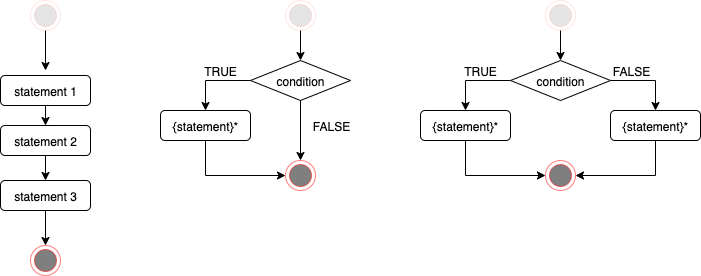

## Flow control

**Flow control** statements allow to:

- decide whether statement(s) (command/expression) get executed at all;
- repeat execution of statement(s) multiple times.



### Sequential execution

In the simplest scenario a program is executed line-by-line:

```{r, eval=FALSE}
statement_1
statement_2
statement_3
```

Note, sometimes several statements might be in the same line separated with semicolon:

```{r, eval=FALSE}
statement_1
statement_2; statement_3
```

### Conditional execution

#### `if`

Runs `statement_T` only when the `condition` is `TRUE`.

```{r, eval=FALSE}
statement_1

if( condition ) {
  # this runs only when the condition is TRUE
  statement_T
}

statement_2
```

#### `if`/`else`

When the `condition` is `TRUE` runs `statement_T`.  
Otherwise runs `statement_F`.

```{r, eval=FALSE}
statement_1

if( condition ) {
  # this runs only when the condition is TRUE
  statement_T
} else {
  # this runs only when the condition is FALSE
  statement_F
}

statement_2
```

#### `if`/`else if`/.../`else`

Multiple conditions can be combined:

```{r, eval=FALSE}
statement_1

if ( condition1 ) {
  # this runs only when the condition1 is TRUE
  statement_T1
} else if( condition2 ) {
  # this runs only when the condition1 was FALSE and the condition2 is TRUE
  statement_T2
} else {
  # this runs only when all above conditions were FALSE
  statement_F
}

statement_2
```

### Looping

#### `for` loop

Executes the same statement a fixed number of times:
```{r}
for( v in 1:5 ) {
  # this runs once for v==1, then v==2, ..., v==5
  print( v )
}
```

Or allows to iterate over each element of a vector:
```{r}
fruits <- c( "apples", "bananas", "cherries" )
for( fruit in fruits ) {
  print( fruit )
}
```

Or for each element of a list:
```{r}
studentScores <- list(
  Amy = c( 4,8,6,9,7 ),
  Bob = c( 3,5,5,4 ),
  Chester = c( 7,7,6,6,9,5,6,8 )
)
meanScores <- c()
for( student in names( studentScores ) ) {
  meanScores[[ student ]] <- mean( studentScores[[ student ]] )
}
meanScores
```

Note, the above example would rather be implemented with `sapply`:
```{r}
meanScores <- sapply( studentScores, mean )
meanScores
```


## Example: a function with `if`/`else` statements

Let's take the following from a [World Health Organization document]():

  - *An `adult` is a person older than 19 years of age unless national law defines a person as being an adult at an earlier age.*
  - *An `adolescent` is a person aged 10 to 19 years inclusive.*
  - *A `child` is a person 19 years or younger unless national law defines a person to be an adult at an earlier age.*
  - *However, in these guidelines when a person falls into the 10 to 19 age category they are referred to as an adolescent (see adolescent definition).*
  - *An `infant` is a child younger than one year of age.*

Now we would like to write a function `ageGroup` which takes age argument (in years) and returns the age group label.

First let's enumerate the age group categories (for a country where 19 years is the adult age):

| group | condition for age [y] |
|-----|----------|
| `adult` | `age > 19` |
| `adolescent` | `age >= 10 && age <= 19` |
| `child` | `age >= 1 && age < 10` |
| `infant` | `age < 1` |

### Function template

Here is a template of the `ageGroup` function:

```{r, eval=FALSE}
ageGroup <- function( age ) { 
  # age: age given in years
  ...
}
```

Here are expected results:

```{r, eval=FALSE}
ageGroup(0)   # "infant"
ageGroup(10)  # "adolescent"
ageGroup(9)   # "child"
ageGroup(20)  # "adult"
ageGroup(-1)  # should generate an error
```

### Poor implementation with `if` only

Let's first implement a dummy function which always returns `child`; of course this would provide wrong results:

```{r}
ageGroup <- function( age ) { 
  # age: age given in years
  result <- "child"
  result
}
```

```{r, collapse=TRUE}
ageGroup(0)   # "infant"
ageGroup(10)  # "adolescent"
ageGroup(9)   # "child"
ageGroup(20)  # "adult"
ageGroup(-1)  # should generate an error
```

Next we add a single conditional to capture `adult` label: 

```{r}
ageGroup <- function( age ) { 
  # age: age given in years
  result <- "child"
  if( age > 19 ) {
    result <- "adult"
  }
  result
}
```

```{r, collapse=TRUE}
ageGroup(0)   # "infant"
ageGroup(10)  # "adolescent"
ageGroup(9)   # "child"
ageGroup(20)  # "adult"
ageGroup(-1)  # should generate an error
```

Finally we add the conditional statements to capture the labels `adolescent` and `infant` in the same way:

```{r}
ageGroup <- function( age ) { 
  # age: age given in years
  result <- "child"
  if( age > 19 ) {
    result <- "adult"
  }
  if( age >= 10 & age <= 19 ) {
    result <- "adolescent"
  } 
  if( age < 1 ) {
    result <- "infant"
  } 
  result
}
```

```{r, collapse=TRUE}
ageGroup(0)   # "infant"
ageGroup(10)  # "adolescent"
ageGroup(9)   # "child"
ageGroup(20)  # "adult"
ageGroup(-1)  # should generate an error
```

To generate the error we request the program to `stop` with an error message:

```{r}
ageGroup <- function( age ) { 
  # age: age given in years
  result <- "child"
  if( age > 19 ) {
    result <- "adult"
  }
  if( age >= 10 & age <= 19 ) {
    result <- "adolescent"
  } 
  if( age < 1 ) {
    result <- "infant"
  } 
  if( age < 0 ) {
    stop( "Age can't be negative." )
  } 
  result
}
```

```{r, collapse=TRUE,error=TRUE}
ageGroup(0)   # "infant"
ageGroup(10)  # "adolescent"
ageGroup(9)   # "child"
ageGroup(20)  # "adult"
ageGroup(-1)  # should generate an error
```

### Better implementation with `if`/`else`

In the previous scenario: when `age` is 30 and the `result` is set to `adult` it makes no sense anymore to check whether `age` is in other ranges.  
`if`/`else` construction allows for that.

```{r}
ageGroup <- function( age ) { 
  # age: age given in years
  if( age > 19 ) {
    result <- "adult"
  } else if( age >= 10 ) {
    result <- "adolescent"
  } else if( age >= 1 ) {
    result <- "child"
  } else if( age >= 0 ) {
    result <- "infant"
  } else {
    stop( "Age can't be negative." )
  }
  result
}
```

```{r, collapse=TRUE,error=TRUE}
ageGroup(0)   # "infant"
ageGroup(10)  # "adolescent"
ageGroup(9)   # "child"
ageGroup(20)  # "adult"
ageGroup(-1)  # should generate an error
```


