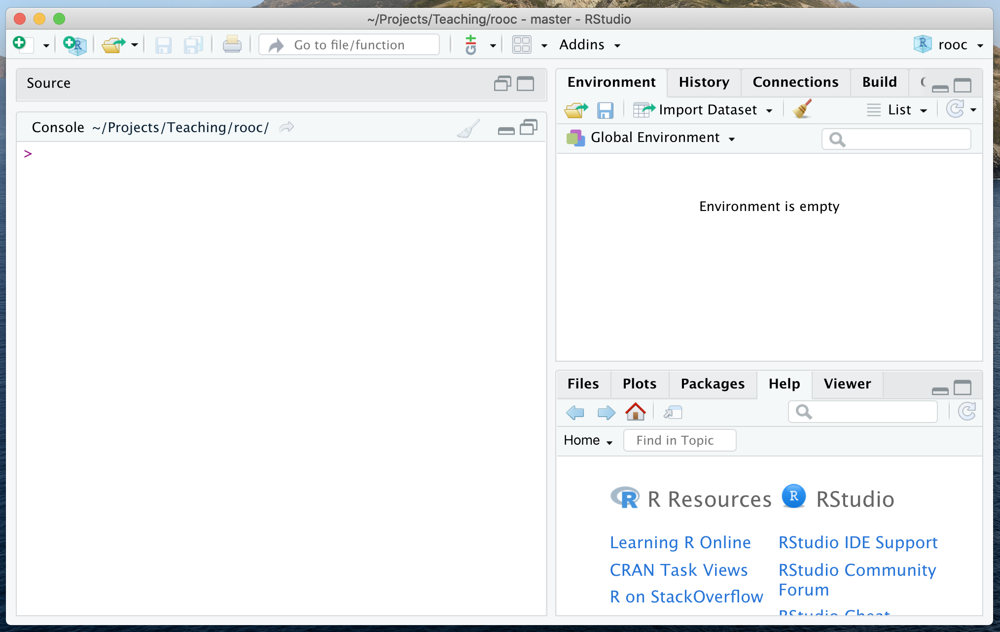

```{r setup, include=FALSE}
knitr::opts_chunk$set(comment = NA, paged.print=FALSE)
build_nocode(params) 
```

```{r, child="_navigate.Rmd"} 
``` 

# Tasks

- In the pane 'Console' type yourself commands described here. Do not use copy/paste!
- Familiarize with error messages caused by typing errors.

# Console pane: prompt and result/output

RStudio window has a pane (a part of the window) called 'Console'.  
It provides a direct connection to the R language interpreter.  



At the prompt symbol `>` you can type any calculations you like.  
Press _Enter_ to see the result/output.

Try the following (or similar) examples:

```{r prompt=TRUE}
4+5
2*8
5^2  # 5 raised to the 2-nd power
2/8
```

```{r, echo=FALSE, results='asis'}
msg <- "A '#' marks the start of an inline comment, all text after it are ignored by the R interpreter."
info_block(msg)
``` 

# Decimal separator: comma vs. dot

Fractional parts are always separated with `.` (dot), never with `,` (comma).

For example, to express "one-half":

```{r prompt=TRUE}
0.5
```

But note the error message:

```{r prompt=TRUE,error=TRUE}
0,5
```

# Order of calculation: parentheses

Use parentheses as much as possible to make sure the calculations are done in the right order.

```{r prompt=TRUE}
12/2*3
12/(2*3)
```

Note the error, when you use brackets instead of parentheses:

```{r promot=TRUE,error=TRUE}
12/[2*3]
```

Or, when you have an extra closing parenthesis:

```{r promot=TRUE,error=TRUE}
12/(2*3))
```

While typing, RStudio may automatically insert a closing parenthesis.  
If you don't like this, change using Tools &#8594; Global &#8594; options &#8594; Code &#8594; Editing.

# Multiline commands

When the prompt symbol changes to `+`, it means that the command in the single line is not finished yet. This might be intentional or mistake:

- When this is intentional, simply continue typing in the next line.
- When this is an error, press _Esc_ or _Ctrl-C_ to return to normal prompt.


A command in a single line might be incomplete because a parenthesis is open, but not closed:

```{r prompt=TRUE}
5*(1+1
)
```

It can be also incomplete because there is an arithmetic symbol at the end of the line:

```{r prompt=TRUE}
1 +
  2 +
  3
```

# Simple functions

Here are examples of several useful functions and how to use them:

```{r prompt=TRUE}
sqrt( 10 )     # square root
log( 10 )      # natural logarithm
log10( 10 )    # logarithm base 10
abs( -10 )     # absolute value
```

Terminology: the _function_ (e.g. `log`) is applied to its _argument_ (e.g. `10`). 
The argument of a function is always between parentheses.

Note the error when you forget to provide the argument:

```{r prompt=TRUE,error=TRUE}
sqrt()
```

# Useful console keystrokes

Try the following keystrokes in the console:

- _Up-arrow_ or _Down-arrow_ scroll through the history of the commands typed before.
- _Ctrl-R_ shows the history, and then you may type characters to search this list.
- _Ctrl_L_ clears the console (but not the history).

```{r, child="_exercises_links.Rmd"}
``` 

```{r, child="_navigate.Rmd"} 
``` 
