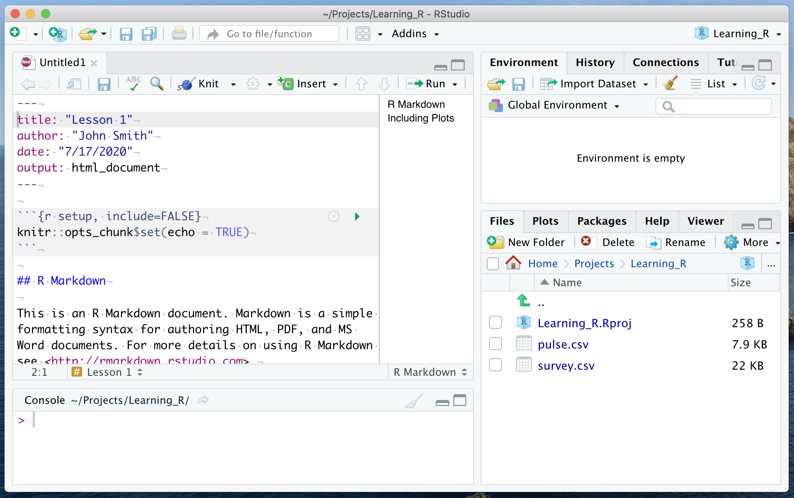

```{r setup, include=FALSE}
knitr::opts_chunk$set(comment = NA, paged.print=FALSE)
build_nocode(params) 
```

```{r, child="_navigate.Rmd"} 
``` 

# Overview

- This material shows a general way to setup a project for a new analysis.
- The example project created here and the copied files are neded later in the course.

# Concept of a project and of scripts

A typical data analysis in R involves multiple files:

- **Input files** with data, fixed before analysis (e.g. files in various formats containing tables of data to be analysed).
- **Scripts** or **reports** (there you develop programs in R language to analyse the data and report results).
- Other files (images, configurations, etc.).

**Project** is a feature of RStudio to organize all files that you need for a single analysis and to keep them separate from other analyses.  
From now on you are going to work within a new R course project.

# Project

## Create a new project

Follow the subsequent steps to create a new project for this R course.  
From the RStudio menu choose: `r show_menu( c( "File", "New project...", "New directory...", "New project..." ) )`.  
In the dialog box:

- As a directory name type (for example): `Learning_R`  
- In the next option you may select where to create this directory.  
- Press `Create project` to finalize the process.

## Check currently open project

Look at the top right corner of the RStudio window to check which project you are working on.  
Refer to the following Figure: it shows a state when a project called `Learning_R` is open.

Moreover, the title line shows **the project diectory** in which the files of the project are/will be kept.

Finally, note **the project file** `Learning_R.Rproj` in the `Files` panel. When you click this file in a file explorer, it should open RStudio and the right project.


# Input data

## Copy data files to the project directory

Although R can be used to analyse data from any readable file, it is convenient to have such files in the project directory.  
For the following parts of the course you need the files: `pulse.csv` and `survey.csv`.  
Download/copy these files to the project directory using system file explorer or browser.  
Since this step depends on the operating system, therefore only a general description is provided here.

Properly downloaded files should appear in the `Files` panel:


## Check access to the files

Copy the following command to the `Console` and execute it to check whether you can access the `pulse.csv` file.  
When the file is present, `TRUE` should be returned:

```{r eval=FALSE,echo=TRUE}
file.exists( "pulse.csv" )
```
```{r eval=TRUE,echo=FALSE}
TRUE
```

# Scripts/reports

## R scripts

**R script** is a simple text file (e.g. `filename.R`) with commands written in R language.  
When an R script is **sourced**, the lines of the script are one-by-one copied to the `Console` and immediately executed.  
An R script allows to save R commands (without saving, the commands given in the `Console` are executed and forgotten).

`r show_warning( "In this course R scripts are not used directly." )`

## R Markdown documents

An [**R Markdown** document](https://rmarkdown.rstudio.com/) (e.g. `filename.Rmd`) is an extension of an R script.  
An R Markdown document is also a simple text file consisting of:

- **chunks** written in R language, where data analysis is performed; 
- free text written in Markdown notation, possibly containing: sections, lists, tables, [hyperlinks](https://rmarkdown.rstudio.com/docs/), formulae: $r=\sqrt{x^2+y^2}$, etc.

R Markdown documents are **knitted** to produce report files.  
Many report output formats are available: HTML, PDF (printable pages or presentations), Microsoft Word documents, etc.

`r watch_extern_video( url = "https://rmarkdown.rstudio.com/lesson-1.html", title = "R Markdown introduction video", src = "RStudio" )`

`r go_extern( url = "https://www.markdowntutorial.com/", title = "Markdown tutorial", goal = "to learn how do write free text using Markdown notation" )`

# A new R Markdown report

## Create

`r show_warning( "Before creating a new document, first check whether you work in the correct project." )`

From the RStudio menu choose: `r show_menu( c( "File", "New File", "R Markdown..." ) )`.  
In the dialog box you may specify some details of the analysis (later change is possible):

- Title of the analysis.  
(Note, this is NOT the name of the `.Rmd` file; this name will be given when the document gets saved.)
- Name of the author.
- Output format (for now, select HTML).

Once accepted, a new document `Untitled1` is shown.  
The document is not empty; it contains an example written in R Markdown.



## `r todo( "Knit" )`

- knit the demo
- clear the demo

## `r todo( "Write an own simple R Markdown document" )`

- header
- chunks; insert chunk keystroke
- run a chunk; keystroke, ctrl-Enter (for current command or marked text)
- load tidyverse
- read table
- show table
- knit complete document (no changes in environment)
- find the produced html

## `r todo( "To describe" )`

- comment char (hash)
- View command

```{r, child="_exercises_links.Rmd"}
``` 

```{r, child="_navigate.Rmd"} 
``` 
