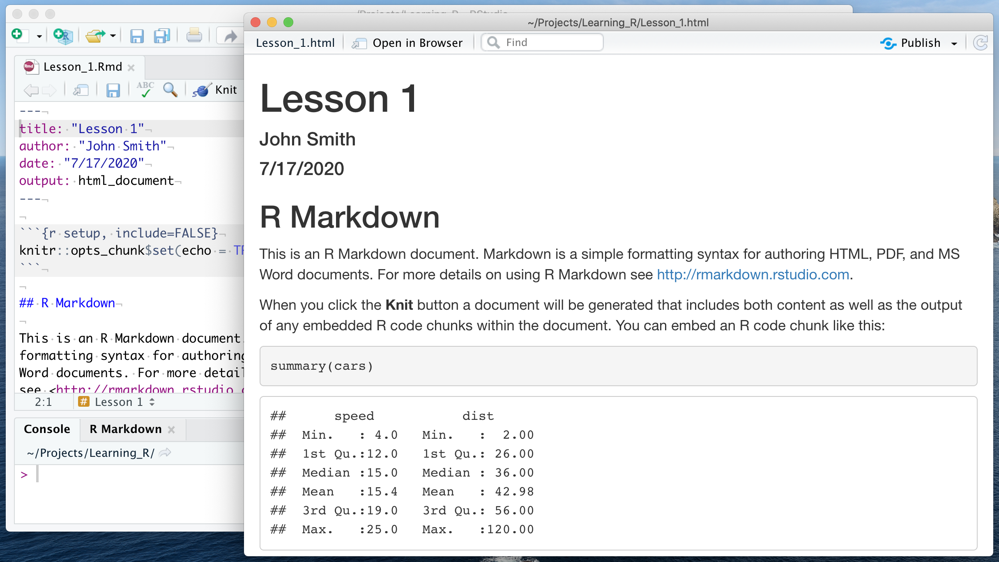
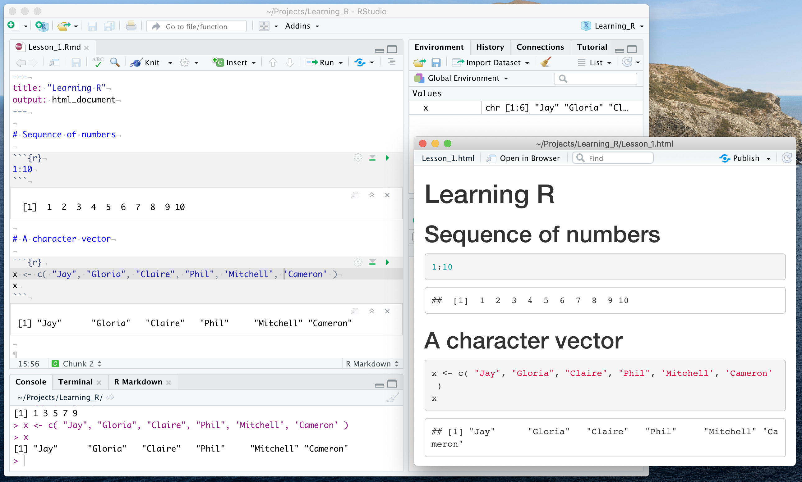

```{r setup, include=FALSE}
knitr::opts_chunk$set(comment = NA, paged.print=FALSE)
build_nocode(params) 
```

```{r, child="_navigate.Rmd"} 
``` 

# R scripts and R Markdown documents

## What is an R script

**R script** is a simple text file (with extension `.R`, for example `my_script.R`) containing commands written in R language.  
When an R script is **sourced**, the lines of the script are one-by-one copied to the `Console` and immediately executed.  
An R script allows to save R commands (without saving, the commands given in the `Console` are executed and forgotten).

`r show_warning( "In this course R scripts are not discussed." )`

## What is an R Markdown document

An [**R Markdown** document](https://rmarkdown.rstudio.com/) (with extension `.Rmd`, for example  `my_report.Rmd`) is an extension of an R script.  
It is a simple text file consisting of:

- **Chunks** written in R language, where data analysis is performed.
- **Free text** written in Markdown notation, possibly containing: sections, lists, tables, [hyperlinks](https://rmarkdown.rstudio.com/docs/), formulae: $r=\sqrt{x^2+y^2}$, etc.

The **Knit** operation converts an R Markdown document into a report file.  
Many report output formats are available: HTML, PDF (printable pages or presentations), Microsoft Word documents, etc.  
_(For example: this page is written in R Markdown and knitted to HTML)_

`r watch_extern_video( url = "https://rmarkdown.rstudio.com/lesson-1.html", title = "R Markdown introduction video", src = "RStudio" )`

`r go_extern( url = "https://www.markdowntutorial.com/", title = "Markdown tutorial", goal = "to quickly practice writing text with Markdown notation" )`

## Create a new R Markdown document

`r show_warning( "Before creating a new document, first check whether you work in the correct project." )`

From the RStudio menu choose: `r show_menu( c( "File", "New File", "R Markdown..." ) )`.  
In the dialog box you may specify some details of the analysis (later change is possible):

- Title of the analysis.  
(Note, this is NOT the name of the `.Rmd` file; this name will be given when the document gets saved.)
- Name of the author.
- Output format (for now, select HTML).

Once accepted, a new document `Untitled1` is shown.  
The document is not empty; it contains an example written in R Markdown.


## Knit an R Markdown document

**Knitting** is the name of the process of conversion from R Markdown text file to a report in one of the target formats (for example: HTML).

- Press the `Knit` button to start the conversion.
- If the R Markdown document does not have a name yet, a save dialog box will pop up to ask for the file name.
- Some libraries might get automatically installed before the first `Knit`.
- The knitting process might take a few seconds and then the final document should appear either in a new window or in the `Viewer` pane.  
The Figure below shows the result of knitting of the standard example (R Markdown was saved as `Lesson_1.Rmd` and was knitted to HTML file `Lesson_1.html`):



## Parts of an R Markdown document

An R Markdown document consists of: header, chunks and free text.

The **header**:

- Is located at the first lines of the file.
- Starts and ends with a line containing `---` (three minus symbols).
- May specify *title*, *author*, *date* and possibly other properties of the document.

`r direct_exercise( "Locate the header in the Figures above and below." )`

`r direct_exercise( "Create a new R Markdown document and make it empty (remove the example text). Then write a header at the top based on the Figure below. Add your name as the author and change the title. Knit to see the effect." )`

`r direct_exercise( "Check the Files panel. Find there the HTML file which was created by knitting." )`

A **chunk**:

- Is a place where code in R language is written. The result of this code will be displayed below the chunk.
- Starts with a line containing ` ```{r} ` (three backticks, then `r` in curly braces).
- Ends with a line containing ` ``` `
- Has gray background by default in RStudio.

`r direct_exercise( "Locate two chunks in the Figure below. Locate a chunk (with a more complex R code) in the Figure above." )`

`r direct_exercise( "Type a new chunk in your document, based on the Figure below. Put a simple R expression into the chunk. Knit to see the effect." )`

`r direct_exercise( "In your document add a new chunk with another R expression. Press the green play button in the upper right corner of the chunk area. Change the expression. Press play again." )`

A **free text**:

- Not the header and not a chunk.
- Has white background by default in RStudio.

`r direct_exercise( "Locate two free text regions in the Figure below." )`

`r direct_exercise( "In your document add some free text. Try to add a section and possibly subsections. Knit to see the effects." )`



## Editing an R Markdown document

**Important difference**:

- When you run a chunk it may use the variables currently present in memory (see `Environment`).   
This is good when you _develop_ your report.
- `Knit` button processes the whole R Markdown with no variables in memory (empty `Environment`).  
This is _necessary for the final version_ of your report.

Useful hints:

- To insert a new chunk you may use menu `r show_menu( c( "Code", "Insert Chunk" ) )` or the keyboard shortcut shown in the menu.
- To run the chunk with the cursor you may use `r show_menu( c( "Code", "Run Region", "Run Current Chunk" ) )` or the keyboard shortcut shown in the menu.
- To run the line with the cursor or selected text you may use `Ctrl-Enter` key combination.

```{r, child="_navigate.Rmd"} 
``` 
