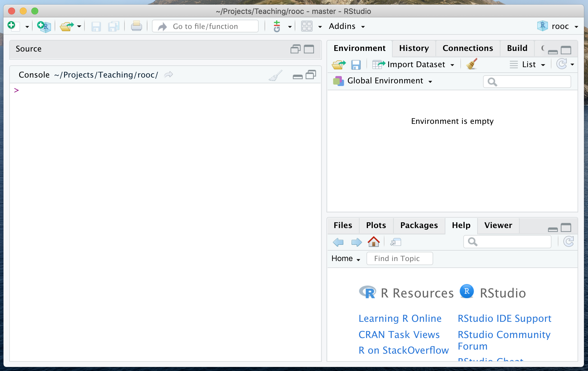

```{r setup, include=FALSE}
knitr::opts_chunk$set(comment = NA, paged.print=FALSE)
build_nocode(params) 
```

```{r, child="_navigate.Rmd"} 
``` 

## Console pane

Start RStudio. You should see a Window similar to the Figure below.  
The window has a pane (a part of the window) called 'Console'.  
The **console** provides a direct connection to the R language interpreter.  



## Prompt and result

After the **prompt** symbol `>` you can type any **expression**.  
Press _Enter_ to see the **result** (output) of the expression.

Type the following (or similar) examples:

```{r prompt=TRUE}
4+5
2*8
2/8
```

A `#` marks the start of a **comment**.  All text after it is simply ignored.  
Type the following line including the a comment:

```{r prompt=TRUE}
5^2  # 5 raised to the 2-nd power
```

## Decimal separator: comma vs. dot

Fractional parts are always separated with `.` (dot), never with `,` (comma).

For example, type to express "one-half":

```{r prompt=TRUE}
0.5
```

But type the following to see the error message:

```{r prompt=TRUE,error=TRUE}
0,5
```

## Order of calculation: parentheses

Use parentheses to be sure that the calculations are done in the right order.  
Type the following to compare:

```{r prompt=TRUE}
12/2*3
12/(2*3)
```

Type the following to see the error for brackets used instead of parentheses:

```{r promot=TRUE,error=TRUE}
12/[2*3]
```

Or, when you have an extra closing parenthesis:

```{r promot=TRUE,error=TRUE}
12/(2*3))
```

While typing, RStudio may automatically insert a closing parenthesis.  
If you don't like this, change option _Insert matching parens/quotes_ in menu `r show_menu( c( "Tools", "Global Options...", "Code", "Editing" ) )`.

## Multiline commands

When the prompt symbol changes to `+`, it means that the command in the single line is not finished yet.  
This might be intentional or mistake:

- When this is intentional, simply continue typing in the next line.
- When this is an error, press _Esc_ or _Ctrl-C_ to return to normal prompt.


A command in a single line might be incomplete because a parenthesis is open, but not closed. Try to type:

```{r prompt=TRUE}
5*(1+1
)
```

It can be also incomplete because there is an arithmetic symbol at the end of the line:

```{r prompt=TRUE}
1 +
  2 +
  3
```

## Simple functions

Here are examples of several useful functions and how to use them. Try to type them in the console:

```{r prompt=TRUE}
sqrt( 10 )     # square root
log( 10 )      # natural logarithm
log10( 10 )    # logarithm base 10
abs( -10 )     # absolute value
```

Terminology: the **function** (e.g. `log`) is applied to its **argument(s)** (e.g. `10`).   
The argument of a function is always between parentheses.

Type the following to observe what happens when you forget to provide the argument:

```{r prompt=TRUE,error=TRUE}
sqrt()
```

Note, that the spaces around the argument are not necessary.  
In the course materials we use spaces to increase readability.

```{r prompt=TRUE}
sqrt(10)
```

## Getting help

To show the manual for a function type the function name after `?` in the `Console`.  
For example:
```{r eval=FALSE}
?sqrt
```

The documentation will be shown in the `Help` pane. Also there you may type the keyword to be searched.

## Useful console keystrokes

Try the following keystrokes in the console:

- _Up-arrow_ or _Down-arrow_ scroll through the history of the commands typed before.
- _Ctrl-R_ shows the history, and then you may type characters to search this list.
- _Ctrl_L_ clears the console (but not the history).


```{r, child="_exercises_links.Rmd"}
``` 

```{r, child="_navigate.Rmd"} 
``` 
