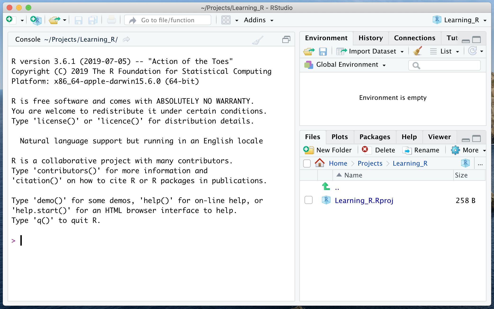
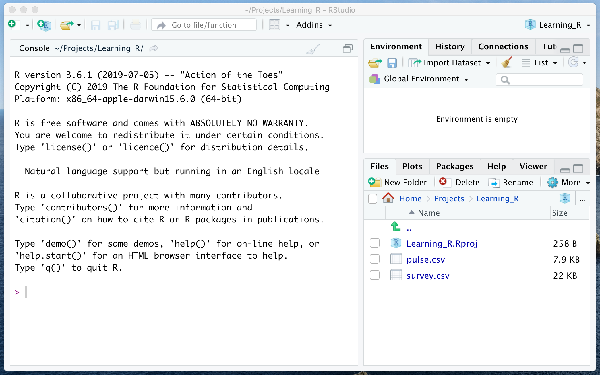

```{r setup, include=FALSE}
knitr::opts_chunk$set(comment = NA, paged.print=FALSE)
build_nocode(params) 
```

```{r, child="_navigate.Rmd"} 
``` 

# RStudio projects

A typical data analysis involves multiple files:

- **Input files** with data, fixed before analysis (e.g. files in various formats containing tables of data to be analysed).
- **Scripts** or **reports** (there you develop programs in R language to analyse the data and report results).

RStudio uses **projects** to organize files of one analysis and separate them from other analyses.  

Here we create the project `Learning_R` with additional files used during the course.

## Create a new project

Follow the subsequent steps to create a new project `Learning_R`.

From the RStudio menu choose: `r show_menu( c( "File", "New project...", "New directory...", "New project..." ) )`.  
In the dialog box:

- As a directory name type: `Learning_R`.
- In the next option you may select where to create this directory.
- Press `Create project` to finalize the process.

## Check the current project

Refer to the following Figure:

- Look at the top right corner of the RStudio window to see the **current project**.  
`Learning_R` is the current project.
- The title line shows the **project diectory**.  
This is the current directory and there the files of the project are/will be kept.
- Note the **project file** `Learning_R.Rproj` in the `Files` panel.  
When you find this file in a system file explorer, once clicked it should start RStudio and open the project.



## Copy input files

Although R can be used to analyse data from files located anywhere in the filesystem, it is convenient to have such files in the project directory.  
For the following parts of the course you need the files: `r data_file( c( "pulse.csv", "survey.csv" ) )`.  
Download (with a browser) or copy (with the system file explorer) these files to the project directory -- here the details depend on the operating system of your computer.

Once the files are present in the project directory, they should be visible in the `Files` panel:



```{r, child="_navigate.Rmd"} 
``` 
