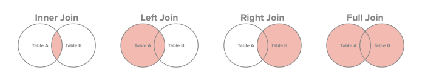

```{r setup, include=FALSE,eval=TRUE}
# library(rooc)
# source("../R/Doc.R")
# source("../R/Globals.R")
pulse <- read_pulse() 
```

> Combine tibbles 

`*_join(...)` is a family of functions for combining two tibbles on common `variable(s)` called `key`. 

<center>

</center>

For example, take a group of people (n=7) for which we have collected age and height data:

```{r}
# height 
df1 <- tibble(name = c("Isa","Jaylinn","Mila","Milas","Yara"),
           height = c(160, 172, 182, 157, 162)) 
df1
# age
df2 <- tibble(name = c("Fiene","Jaylinn","Mila","Noah","Yara"),
           age = c(20,24,17,23,17)) 
df2
```

The information here is incomplete, for some we have only `height` and for some only `age`. Now we want to combine these tibbles into a single table with variables `name`, `age` and `height`. We can do this with a join function which is able to combine observations (rows) by **matching on the common variable(s) between the two tibbles**. Matching is done **by** one or more variables, in this case the variable `name`.

`r info_block("Keep in mind that for a proper joining of data, the matched variable(s), also known as the key, must be unique in both tibbles.")`

## Join : single variable 

You may control the layout of the combined table by choosing one of the three join function laid out below.

### inner_join

Return all rows in `df1` where there are matching values of `name` in `df2` and all columns in both `df1` and `df2`: 

```{r}
inner_join(df1,df2, by = "name")

```

### left_join

Return all rows from `df1` and all columns in both `df1` and `df2`, `NA` for missing values in `df2`:

```{r}
left_join(df1,df2, by = "name")
```


### full_join 

All rows and all columns in `df1` and `df2`.

```{r}
full_join(df1,df2, by = "name")
```

## Non-unique keys

If the keys are not unique in either of the tibbles then the result will be ambiguous. Take for example `df1` defined above, we now add another observation with name `Yara` and height `168`:

```{r}
df1 <- tibble(name = c("Isa","Jaylinn","Mila","Milas","Yara", "Yara"),
           height = c(160, 172, 182, 157, 162, 168))
df1
```

This will make the key, variable `name`, non-unique. Notice the result of a  full join:

```{r}
full_join(df1, df2, "name")
```

As you can see the join found two matches for *Yara* in `df1`, so both are taken and the age for *Yara* in `df2` is replicated.  

`r info_block("Use only unique key in joins to avoid ambiguous results.")`


What if we update df2 also with name `Yara` with age `19` and apply a join? 

```{r}
df2 <- tibble(name = c("Fiene","Jaylinn","Mila","Noah","Yara", "Yara"),
           age = c(20,24,17,23,17,19)) 
df2
```

```{r}
full_join(df1,df2,"name")

```

As you can see we have now 4 ambiguous observations for Yara 

## Variable name conflicts

Take `df1` as defined above and `df3`: 

```{r}
# height (cm)
df1 <- tibble(name = c("Isa","Jaylinn","Mila","Milas","Yara"),
           height = c(160, 172, 182, 157, 162))

# height (feet)
df3 <-   df1 %>% mutate(height=height/30.48)
df3
```

both of these tibbles have the variable height, after joining by `name` :

```{r}
left_join(df1,df3,by="name")
```

we see that `left_join` distinguishes `height` from `df1` and the `height` from `df3` with suffixes `.x` and `.y` respectively. 


There are several more join functions not covered here such as right_join (opposite of left_join), semi_join and anti_join (see [dplyr cheat sheet](https://github.com/rstudio/cheatsheets/raw/master/data-transformation.pdf)).


<!--

#### right_join

Return all rows from `df2` and all columns in both `df1` and `df2`, `NA` for missing values in `df1`

```{r}
right_join(df1,df2,"name")
```

#### semi_join

Identical to `inner_join` keeping only columns in `df1`  # (exception: no duplicated rows in df1.)

```{r}
semi_join(df1,df2,"name")
```

#### anti_join

Complement of `semi_join`, return rows from `df1` with no match in `df2`. 

```{r}
anti_join(df1,df2,"name")
```

-->

## Unique keys

### base::duplicated(...) function

The base function `duplicated` can be used to find duplicates in a vector or a tibble. 

```{r}
v <- c("Isa","Jaylinn","Mila","Bonnie", "Yara", "Mila", "Isa", "Mila")
v
```

Here `Isa` and `Mila` occur two and three times respectively. The function `duplicated` returns a logical with TRUE at corresponding positions whenever it matches a value that it had already seen from position 1 to n, n being the length of the vector in this case.    

```{r}
duplicated(v)
```


`r info_block("duplicated(...) function does not mark the first occurence of the duplicated values with TRUE.")`


On tibbles the function `duplicated` can handle multiple variables(columns):

```{r}
# the two observations on Yara are identical
df1 <- tibble(name = c("Isa","Jaylinn","Mila","Milas","Yara", "Yara"),
           height = c(160, 172, 182, 157, 162, 162))
df1
duplicated(df1)
```

We can use this logical vector to filter observations from `df1`:

```{r}
df1 %>%  filter(duplicated(df1))
```

Note that we only get 1 row as the result and not 2 because of the behaviour of duplicated function which does not mark the first match.

### Test uniqueness of a key set

We can now test whether certain combinations of variables can uniquely identify each observation in the dataset. Let us take the variables {name,age} in the pulse dataset:

```{r}
key1 <- pulse %>%  select(name,age)
key1

```


If the `duplicated` function returns FALSE for all positions in `key1` tibble then it means it did not find any duplicates.

```{r}
# sum over a logical vector counts the number of TRUE values
sum(duplicated(key1)) 
```

the sum here is non-zero therefore there are duplicated values, i.e. the key set `key1` is not unique.

## Join : multiple variables as the key

To illustrate let's split the pulse dataset into two separate tibbles with common variables `name` and `height`: 

```{r}
p1 <- pulse  %>% select(name,height,age,gender,year)
p1
p2 <- pulse  %>% select(-age,-gender,-year)
p2
```

`p1` has the common variables `{name,height}` (the key) and additional variables `{age,gender,year}`, and `p2` has the same key variables `{name,height}` with some other measurement variables such as `pulse1` `pulse2`  etc.


> Is the combination `{name,height}` a valid choice as the unique key to join two tibbles p1 and p2? 

```{r, echo=FALSE, results='asis'}
msg <- "Yes. This because the combination is unique in the table. You can check the uniqueness of {name,height} with the command duplicated, see also ?base::duplicated.  The statement
sum(duplicated(pulse %>% select(name,height)))==0 tests whether the number of duplicates is equal to 0."
qa(msg)
```

Now we want to join them back together using `full_join`: 

```{r}
full_join(p1,p2) # common variables are used when no variable is specified. 
```

It is a **better practice** to explicitly specify the variables: 

```{r} 
pulse_joined <- full_join(p1,p2, by = c("name","height"))
pulse_joined
```

You may check: 

```{r}
all_equal(pulse,pulse_joined) # caution: all_equal is an experimental function
```

`r show_warning(" The function all_equal is an experimental function and may become obsolete! ")`

