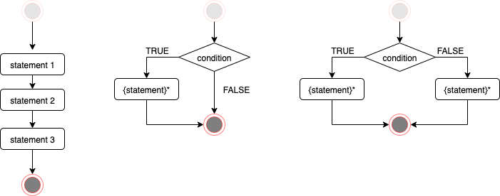

## Flow control

**Flow control** statements allow to:

- decide whether statement(s) (command/expression) get executed at all;
- repeat execution of statement(s) multiple times.



### Sequential execution

In the simplest scenario a program is executed line-by-line:

```{r, eval=FALSE}
statement_1
statement_2
statement_3
```

Note, sometimes several statements might be in the same line separated with semicolon:

```{r, eval=FALSE}
statement_1
statement_2; statement_3
```

### Conditional execution

#### `if`

Runs `statement_T` only when the `condition` is `TRUE`.

```{r, eval=FALSE}
statement_1

if( condition ) {
  # this runs only when the condition is TRUE
  statement_T
}

statement_2
```

#### `if`/`else`

When the `condition` is `TRUE` runs `statement_T`.  
Otherwise runs `statement_F`.

```{r, eval=FALSE}
statement_1

if( condition ) {
  # this runs only when the condition is TRUE
  statement_T
} else {
  # this runs only when the condition is FALSE
  statement_F
}

statement_2
```

#### `if`/`else if`/.../`else`

Multiple conditions can be combined:

```{r, eval=FALSE}
statement_1

if ( condition1 ) {
  # this runs only when the condition1 is TRUE
  statement_T1
} else if( condition2 ) {
  # this runs only when the condition1 was FALSE and the condition2 is TRUE
  statement_T2
} else {
  # this runs only when all above conditions were FALSE
  statement_F
}

statement_2
```

### Looping

#### `for` loop

Executes the same statement a fixed number of times:
```{r}
for( v in 1:5 ) {
  # this runs once for v==1, then v==2, ..., v==5
  print( v )
}
```

Or allows to iterate over each element of a vector:
```{r}
fruits <- c( "apples", "bananas", "cherries" )
for( fruit in fruits ) {
  print( fruit )
}
```

Or for each element of a list:
```{r}
studentScores <- list(
  Amy = c( 4,8,6,9,7 ),
  Bob = c( 3,5,5,4 ),
  Chester = c( 7,7,6,6,9,5,6,8 )
)
meanScores <- c()
for( student in names( studentScores ) ) {
  meanScores[[ student ]] <- mean( studentScores[[ student ]] )
}
meanScores
```

Note, the above example would rather be implemented with `sapply`:
```{r}
meanScores <- sapply( studentScores, mean )
meanScores
```


