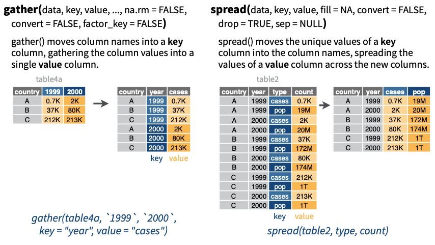

```{r setup, include=FALSE}
knitr::opts_chunk$set(comment = NA, paged.print=FALSE)
build_nocode(params)  # UNCOMMENT IF SLOT HAS TASKS.
pulse <- read_pulse()
```

```{r, echo=FALSE, results='asis'}
navigate_slots(params)
```

> Change layout of values in a table 
 



*Source:* [data import cheat sheet : tidyr](pdf/data-import.pdf)

Two main functions to manipulate the layout of the table, `gather` transforms the table from wide to long format and spread, which does the opposite, converts the table from long to wide format.

## `gather` : wide to long format

This function allows collapsing 'similar' variables into one variable while guaranteeing the data set's consistency. For example take the variables `pulse1` and `pulse2` in the following subset of the pulse data set:   
```{r}
pulses <- pulse  %>%  
      select(name,pulse1,pulse2)  %>% 
      head(3) 
pulses
```

We can transform the table as such that all pulse values are under a single variable, say `pulse`:

```{r}
dfLong <- pulses %>% gather(pulse,level, pulse1,pulse2)
dfLong
```

This is called the long version of the original (wide) table and contains the same information. 

> Can you find ohter variables in the pulse data set which can be 'gathered'?

```{r, echo=FALSE, results='asis'}
msg <- "Yes, for example smokes and alcohol, both are categorical with values {yes,no}."
qa(msg)
```

Let's reshape the pulse dataset with variables `drug_habit` = {smokes,alcohol} and `drug_use` = {yes,no}.

```{r}
pulse %>% gather(drug_habit, drug_use, smokes, alcohol)
```

## `spread` : long to wide format

```{r}
dfWide <- dfLong %>% spread(key=pulse,value=level)
dfWide
```


```{r, child="_exercises_links.Rmd"}
``` 

```{r, echo=FALSE, results='asis'}
navigate_slots(params)
```

