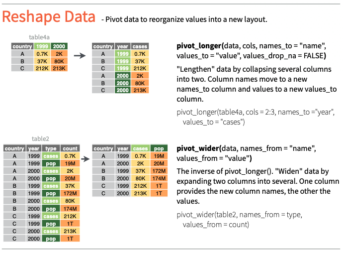

```{r setup,include=FALSE,eval=TRUE}
# library(rooc)
# source("../R/Doc.R")
# source("../R/Globals.R")

pulse <- read_pulse() 
```

> Change layout of values in a table 
 
<!-- building the course can not find images/tidyr_reshape.png !!!
<center> 

</center> 
-->

*Source:* [data import cheat sheet : tidyr](https://tidyr.tidyverse.org)


Two main functions to manipulate the layout of the table, `pivot_longer` transforms the table from wide to long format and `pivot_wider`, which does the opposite, converts the table from long to wide format.

## `pivot_longer` : wide to long format

This function allows collapsing 'similar' variables into one variable while guaranteeing the data set's consistency. For example take the variables `pulse1` and `pulse2` in the following subset of the pulse data set:   
```{r}
pulses <- pulse  %>%  
      select(name,pulse1,pulse2)  %>% 
      head(3) 
pulses
```

We can transform the table as such that all pulse values are under a single variable, say `pulse`:

```{r}
dfLong <- pulses %>% pivot_longer(c(pulse1, pulse2), names_to = "pulse", values_to = "level")
dfLong
```

This is called the long version of the original (wide) table and contains the same information.

Alternatively you achieve the same result using `!` (negation operator):

```{r}
dfLong <- pulses %>% pivot_longer(!name, names_to = "pulse", values_to = "level")
dfLong
```


> Can you find ohter variables in the pulse data set which can be transformed to long format?

```{r, echo=FALSE, results='asis'}
msg <- "Yes, for example smokes and alcohol, both are categorical with values {yes,no}."
qa(msg)
```

Let's reshape the pulse dataset with variables `drug` = {smokes,alcohol} and `use` = {yes,no}.

```{r}
pulse %>%  pivot_longer(c(smokes,alcohol), names_to = "drug", values_to = "use")
```


## `pivot_wider` : long to wide format

```{r}
dfWide <- dfLong %>% pivot_wider(names_from = "pulse", values_from = "level")
dfWide
```


> Below, pulses tibble has been transformed into pulses2. What can you say about this transformation?       

```{r, eval=FALSE}
pulses2 <- pulses %>% 
           pivot_longer(!name, names_to = "pulse", values_to = "level") %>% 
           pivot_wider(names_from = "pulse", values_from = "level")
```


```{r, echo=FALSE, results='asis'}
msg <- "pulses and pulses2 are identical"
qa(msg)
```


## ggplot and reshaping

Often you will need to reshape your data for ggplot visualisations. For example we would like to compare `pulse1` and  `pulse2` variables with a `boxplot`. You may plot pulse1 and pulse2 in separate plots one after the other:

```{r, message=FALSE, warning=FALSE}
require(gridExtra)  # Make sure gridExtra is installed with install.packages("gridExtra").

bp1 <- ggplot(pulse %>% drop_na()) +  # remove missing
  aes(y=pulse1) +
  geom_boxplot()
bp2 <- ggplot(pulse %>% drop_na()) +  # remove missing
  aes(y=pulse2) +
  geom_boxplot()
grid.arrange(bp1, bp2, ncol=2)
```

As you can see the y-scale of each plot is set dynamically and can be misleading. To resolve this, we would need a single plot with aesthetic mapping of `x` being  the categorical variable `pulse` and `y` the pulse values as was shown above.  

```{r}
ggplot(pulse %>% 
         drop_na() %>%  # remove missing 
         pivot_longer( c(pulse1,pulse2), names_to = "pulse", values_to = "level")
       ) +  
  aes(x=pulse, y=level) +
  geom_boxplot()
```

