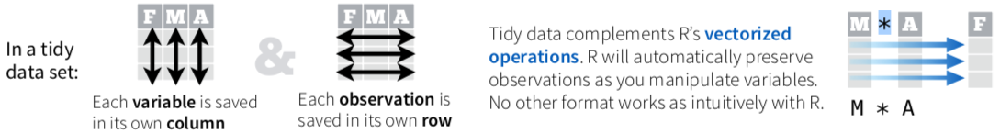

```{r setup, include=FALSE}
knitr::opts_chunk$set(comment = NA)
library( tidyverse )
source("setup.R")
build_nocode(params)
# rmarkdown::render("_build_exercises.Rmd", params = list(title="aap"))

```


# `dplyr` : data.frame manipulation

The goal of this session is to learn how to manipulate data.frames in a more general and abstract way. 

</p>



</p>

The package dplyr ([cheat sheet](http://www.rstudio.com/wp-content/uploads/2015/02/data-wrangling-cheatsheet.pdf)) 
provide the means to:

- `select`, reorder, `rename`  columns (variables)
-  find `distinct` values and their number of occurrences
- `filter`/`arrange` rows (observations)
- `group` and `summarise` rows
- `mutate` : add new columns based on existing ones


## Loading libraries and data

```{r warning=FALSE,message=FALSE}
# install.packages( "tidyverse" )
library( tidyverse )
```

As before in this document the data.frame `pulse` is used for illustration and `survey` for exercises: 

```{r}
pulse  <- read.delim("data/pulse.txt") 
survey <- read.delim("data/survey.txt")
```

## `tibble` : create a data.frame  

```{r}
# Base R : data.frame
t1 <- data.frame(name=c("Lucas","Lotte","Noa"), 
                 year=1995, 
                 color=c("Blue","Blue","Green"))
t1
# tidyverse : tibble (?'tbl_df-class')
t2  <- tibble(name=c("Lucas","Lotte","Noa"), 
             year=1995, 
             color=c("Blue","Blue","Green"))

t2
class(t1)
class(t2)
```


Use of `tibble` instead of `data.frame` leads to i) a more robust code and ii) better layout on screen.  

Differences in behaviour in relation with data.frame:

  - strings not as factors
  - column names are not changed, for example in case of duplicate names
  - row names are not added ( and their use is discouraged )
  - single column selection (e.g. t2[,2]) returns a tibble
  - no partial matching with $ access

And in terms of layout:

  - print as much as possible to fill the screen including summaries 
  - visible meta information such as dimensions and types of the variables

You can convert an existing `data.frame` into `tibble` format using the function `as_tibble(...)`: 

```{r}
pulse <- as_tibble(pulse) 
pulse
class(pulse)
```

Note that the class of the data.frame has changed. You can revert to the original class by:

```{r}
d <- data.frame(pulse)
class(d)
```

## Pipe sign `%>%` 

The pipe mechanism enables you to concentrate on the steps rather than the intermediate objects and is a convenient model for prototyping.


```{r}
pulse %>% dim()     #  <=> dim(pulse)
pulse %>% nrow()    #  <=> nrow(pulse)
pulse %>% head(3)  #  <=> head(pulse,3) 
```


Often we are only interested in the final result and less in the intermediate ones. For example let's say we want to calculate the number of cells in a data.frame, in base R this will be done as follows: 

```{r}
dims  <- dim(pulse)
dims
cells <- prod(dims)  # prod calculates the total product of the  given vector 
cells
```

By using the pipe mechanism (`%>%`) we  can skip the intermediate variable `dims` 

```{r}
# when breaking the line the new line is always after `%>%`
cells <- pulse %>% 
         dim() %>%
         prod()  
cells
```

One may argue that the same is possible in base R :

```{r}
# Base R
prod(dim(pulse))
```

However, this way of coding will become unmanageable when the number of steps increase. 

A less apparent advantage of the pipe mechanism is that the order of applying the functions follows the steps needed and the line of thought whereas base R the steps are written in the opposite direction.  


```{r, child="_exercises_links.Rmd"}
``` 

## Selecting, reordering, renaming columns


```{r}
pulse # pulse data in tibble format
```

Selecting some columns:

```{r}
pulse %>% select( name, age )
```

Change column order: 

```{r}
pulse %>% select( age, name )
```

Selecting columns by index: 

```{r}
pulse %>% select( 1, ncol(pulse) )  # first and last column <=> select(name,year)
```

Selecting an index range:

```{r}
pulse %>% select( 1, 5:7 ) # <=> select( c(1, 5:7) )
```

Deselecting columns: 

```{r}
pulse %>% select( -smokes, -alcohol)
pulse %>% select( -6, -7)  # <=> select( -(6:7) )
```

Rename and select:

```{r}
pulse %>% select( FirstName = name, Age = age )
```

`rename` columns without selecting:

```{r}
pulse %>% rename( First = name, Age = age )
```

Shuffle variables:

```{r}
pulse %>% select( name, age, everything() ) # everything() == all except {name,age} 
```

## Distinct values in a variable or set of variables

To identify distinct values in a variable use `distinct`:

```{r}
pulse %>% distinct( year )
pulse %>% distinct( exercise )
pulse %>% distinct( ran ) 
```

For multiple columns it is possible to identify distinct rows:
```{r}
pulse %>% distinct( gender, exercise )
```

## Counting occurrences of values

To count distinct values in a variable:

```{r}
pulse %>% count( year )
pulse %>% count( gender )
pulse %>% count( age )
```

For multiple variables, it is the count of each possible combination:

```{r}
pulse %>% count( gender, exercise )
pulse %>% count( year, gender )
```

Note: this is a contingency table in disguise (long format)  

## Filtering : selection of rows (observations)

### Filter on a single condition

```{r}
pulse %>% filter( age == 22 ) 
```

**Quiz:** Filter all observations in pulse data where age is 22 using only base R. 


The following illustrates how to produce a summary on a subset of obserations without storing the intermediate results: 

```{r}
pulse %>% filter( age  > 20 ) %>% count(gender) 
pulse %>% filter( age >= 20 ) %>% count(smokes) 
```

### Filter on multiple conditions : logical expression ( `&` `|` )

```{r}
pulse %>% filter( age <= 20 & exercise == "moderate" ) %>% count( gender)
pulse %>% filter( age <= 20 & exercise == "moderate" ) %>% count( gender, year)

```

###  Separating filtering conditions

```{r}
pulse %>% filter( age <= 20 ) %>%  filter(exercise == "moderate" ) %>% count( gender)
```

### Filter on multiple values of the same variable

```{r}
pulse %>% filter( exercise == "high" |  exercise =="moderate" )  %>% count(exercise) # <=> exercise %in% c( "high", "moderate" )
```

```{r}
selectedYears <- c( 1993, 1995 ) 
pulse %>% filter( year %in% selectedYears ) %>% count()
```


```{r, child="_exercises_links.Rmd"}
``` 


## Add new variables

Use `mutate` to add new columns/variables from a selection of existing ones.

Average pulse:

```{r}
pulse %>% mutate( averagePulse = (pulse1+pulse2)/2 ) # by default new column comes last
pulse %>% mutate( averagePulse = (pulse1+pulse2)/2 ) %>% 
      select( averagePulse, pulse1, pulse2, everything() )
```

BMI:

```{r}
pulse %>%  mutate(BMI=weight/(height/100)^2) %>% 
  select( BMI, pulse1, pulse2, everything() )
```

```{r, child="_exercises_links.Rmd"}
``` 

```

## Calculating summaries

`summarize` produces a single output row for the whole table:
```{r}
pulse %>% summarize( count = n(), meanHeight = mean( height ) )
pulse %>% summarize( count = n(), meanAge = mean( age ) )
```

## Operations on groups

Group per `age` and `gender`, note the tag `Groups: age, gender` in the output:

```{r}
pulse %>% group_by( age,gender )
```

Once groups are defined with `group_by`, `summarize` produces a single row output for each group:

```{r}
pulse %>% group_by( age, gender ) %>% summarize( count = n() ) # <=> pulse %>% count(age,gender)
```

Multiple stats can be calculated in one `summarize` command.

```{r}
pulse %>% group_by(age,gender) %>% summarise(count=n(),meanHeight=mean(height), meanWeight=mean(weight))
```

### Example queries

Group per `gender` on those that `ran` and summarize on mean `age`, `pulse1` and `pulse2` 

```{r}
pulse %>% filter(ran == "ran") %>% group_by( gender ) %>% 
    summarize( count = n(), meanAge= mean(age), meanPluse1 = mean(pulse1), meanPulse2 = mean( pulse2 ) )
```

now for those who `sat`:

```{r}
pulse %>% filter(ran == "sat") %>% group_by( gender ) %>% 
    summarize( count = n(), meanAge= mean(age), meanPluse1 = mean(pulse1), meanPulse2 = mean( pulse2 ) )
```

Note the there are missing values, account for it by using `na.rm=TRUE`:  

```{r}
pulse %>% filter(ran == "sat") %>% group_by( gender ) %>% 
    summarize( count = n(), meanAge= mean(age), 
               meanPluse1 = mean(pulse1,na.rm=TRUE), meanPulse2 = mean( pulse2 , na.rm=TRUE) )
```

Use `ungroup` to remove grouping:

```{r}
pulse  %>% group_by( gender ) %>% ungroup()
```

## Sorting (arranging) rows


Sort by `name`

```{r}
pulse %>%  arrange(name)

```

Reverse the order by function `desc`

```{r}
pulse %>%  arrange(desc(name))
```

Arrange by multiple variables: 

```{r}
pulse %>%  arrange(height,weight)
pulse %>%  arrange(weight,height)

```


Grouping based on `age` gives `r  length(attributes(pulse %>%  group_by(age))$group_sizes) ` groups and is arranged in ascending order by default:

```{r}
pulse %>%  group_by(age) %>% summarize(count= n()) 
```

Use `desc` for decreasing order:

```{r}
pulse %>%  group_by(age) %>% summarize(count= n()) %>% arrange(desc(age))
```


```{r, child="_exercises_links.Rmd"}
``` 


## Extra exercises

```{r, child="_exercises_links.Rmd"}
``` 


